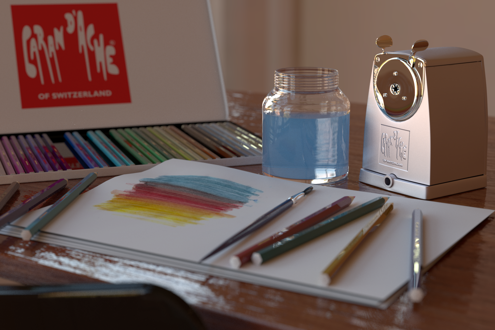

@page assignment6 A6: Final project

@m_footernavigation
@tableofcontents

Project Theme: "TBD"
=================================

Implementation
==============
@m_span{m-label m-primary m-flat} 16 pts @m_endspan

In your renderer you are required to implement a minimum set of features that will be showcased in your report for grading. Features/Functionality are split into 3 categories: simple, moderate and advanced. Your task is to submit in your report any combination of the following types of features that sums up to 16 points. _The only restriction is that you must implement at least 1 advanced feature_.

* Simple features can get up to a maximum of 1 points each (e.g. depth of field) 
* Moderate features can get up to a maximum of 4 points each (e.g. environment map emitter with importance sampling, texturing and bump mapping, or anisotropic microfacet BRDF) 
* Advanced features can get up to a maximum of 8 points (e.g. photon mapping, participating media, or subsurface scattering) 

The above point breakdowns are just a rough guide. Its possible to e.g. implement a very sophisticated version of a simple algorithm and this would be worth more than a bare-bones version of the same method. Correctness and sufficient _validation_ will highly impact the final grade. It is your job to convince us that your implementation is correct. For instance, an untested and buggy implementation of an advanced feature such as the beam radiance estimate may end up getting you less points than a very well tested, and sophisticated depth-of-field implementation. Each graded feature you point out in your report will be graded for completeness and correctness. In your report you should have:

* Feature-specific renderings showcasing a scene that emphasizes the feature's effect. 
* Technical details of the implementation.
* _Validation tests_ performed and their results.
* Code coordinates for the bulk of the feature's implementation. 

We will not be giving out a list of approved features for each category, we leave this up to you. Graded features which you don't end up using in your final image must still include the above details for grading.

Presentation & Report
=====================
@m_span{m-label m-primary m-flat} 3 pts @m_endspan

The rendering competition will replace the final examination period on TBD.

We will quickly introduce the jury and then start with the presentations in random order. Each student will have up to (TBD) minutes of presentation followed by up to (TBD) minutes of questions by the jury. After the presentations the jury will deliberate and choose the winners. We will end the competition with the award ceremony!

Neatness and completeness of your oral presentation and your report will be graded.

Grading
=======

Only code that you implemented will be graded. Code that was graded in previous assignments will not be considered for grading in the final project. Code that was not written during the class or not by the student submitting the project will not be considered for grading and _must_ be properly documented/credited.

What to submit
==============

Your submission must contain:

* The complete source code with all solution and source files, but NO binaries. Don't remove the dependencies, but remove the unnecessary scenes and mesh files. Your final scene files as well as your validation scenes and tests should be included.
* An html file named report.html in the following format:

    Structure the document in sections where in each section you describe a graded feature of your renderer. In addition your document should start with a section showcasing your motivation image and end with a section showing your final submitted image. This document will be uploaded on the rendering competition website and will be publicly available.
    
    For every selected (graded) functonality/feature include a feature specific image(s) you generated (if applicable) in a format that is view-able within a web browser. The image(s) must convince us that the functionality is implemented correctly and completely. You can follow the validation paradigm we used in the homework. Also include descriptions of encountered problems, a list of external libraries that you used and other comments for each selected functionality. End with a summary section which briefly describes other functionality that was implemented but not submitted for grading.
    
* A Powerpoint, Keynote or PDF file named `presentation-firstname-lastname.extension` :
    
    This file will contain your presentation that will be presented in front of the judges during the rendering competition. The structure of your presentation should follow these guidelines:
    
    * An inspiring photograph and its relation to the theme. Point out the interesting phenomena in the image.
    * Provide a brief overview of the functionality/features of your renderer.
    * Point out technical details and challenges for a set of interesting features you have implemented.
    * Presentation ends with your final image, your submission for the rendering competition.

Past Year's Winning Entries
===========================

For inspiration, have a look at the past year's winning entries in the rendering competition conducted as a part of the image synthesis class taught at ETH below.

@m_footernavigation
